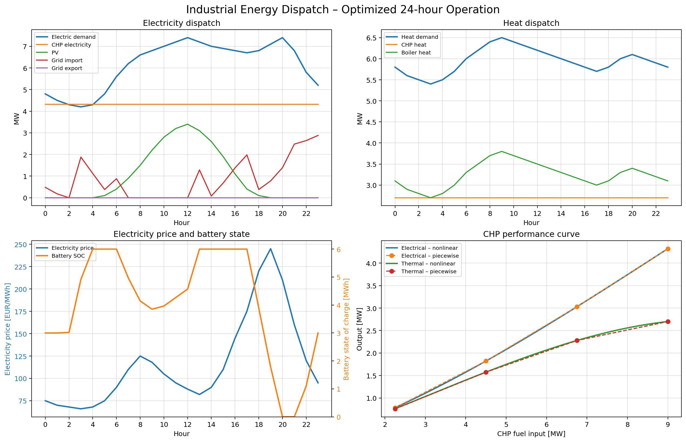

# Industrial Energy Dispatch Demo

## Goal

This project demonstrates a simplified 24-hour industrial energy dispatch optimization. The system contains:

- CHP (combined heat and power),
- gas boiler,
- photovoltaic generation,
- battery storage,
- grid import/export.

The optimizer minimizes daily operating cost while satisfying heat and electricity balances and technical limits.

## Optimization model

The problem is formulated as a **mixed-integer linear program (MILP)**:

\[
\min_x c^T x
\]

subject to

\[
lb \le Ax \le ub
\]

plus variable bounds and binary constraints.

The important modeling idea is that the CHP performance is originally nonlinear. It is represented by a **piecewise-linear approximation** so that the complete 24-hour model can still be solved as a MILP.

## CHP piecewise-linearization

For several known CHP operating points we precompute:

- fuel input \(f_s\),
- electrical output \(p_s\),
- thermal output \(q_s\).

For every hour the model uses:

- binary `SEG[t,s]` — selects one active segment,
- continuous `ALPHA[t,s]` — position inside the active segment.

The constraints are:

\[
\sum_s SEG_{t,s}=ON_t
\]

\[
0 \le ALPHA_{t,s}\le SEG_{t,s}
\]

\[
F_{CHP,t}=\sum_s \left[f_s SEG_{t,s}+(f_{s+1}-f_s)ALPHA_{t,s}\right]
\]

and the same interpolation is used for electrical and thermal output.

This makes fuel, electricity and heat represent one consistent point on the approximated CHP characteristic.

## Main physical constraints

Heat balance:

\[
Q_{CHP,t}+\eta_B F_{B,t}=D_{heat,t}
\]

Electricity balance:

\[
P_{CHP,t}+PV_t+P_{IMP,t}-P_{EXP,t}+P_{DIS,t}-P_{CHG,t}=D_{el,t}
\]

Battery state:

\[
SOC_t=SOC_{t-1}+\eta_c P_{CHG,t}-P_{DIS,t}/\eta_d
\]

CHP ramp:

\[
-R \le F_{CHP,t}-F_{CHP,t-1}\le R
\]

The model also contains CHP ON/OFF logic, startup cost, device capacities, grid limits and equal initial/final battery SOC.

## Objective

The daily objective includes:

- gas consumption,
- electricity import,
- export revenue,
- battery cycling cost,
- CHP startup cost.

## Validation

After solving, the model checks:

- heat balance,
- electricity balance,
- grid limits,
- battery SOC,
- CHP ramp limit.

The MILP solver does **not** verify the accuracy of the piecewise approximation relative to the original nonlinear CHP curve. That should be validated separately by comparing the original and approximated characteristics and adding breakpoints if necessary.

## Why this project is intentionally simplified

The model is intended as a compact engineering/optimization demonstration, not a digital twin of a real plant. It keeps the core ideas visible:

- physical balances,
- equipment limits,
- time coupling,
- binary operating decisions,
- nonlinear equipment behavior approximated inside a MILP,
- economic dispatch.

## How to run

Install the required Python packages:

```bash
pip install -r requirements.txt
```

Run the model:

```bash
python industrial_energy_dispatch_piecewise.py
```

The script prints a cost summary, saves the complete hourly dispatch to
`dispatch_results_piecewise.csv`, and generates the four-panel dashboard.

## Example output



## Repository contents

- `industrial_energy_dispatch_piecewise.py` — optimization model and plots
- `README.md` — project overview
- `Industrial_Energy_Dispatch_manual.docx` — detailed mathematical and implementation notes
- `requirements.txt` — Python dependencies
- `images/energy_dispatch_dashboard.png` — example optimized dispatch
- `LICENSE` — project license

## License

This project is released under the MIT License. See `LICENSE` for details.


See `Industrial_Energy_Dispatch_manual.docx` for a detailed derivation of the equations and matrix structure.
